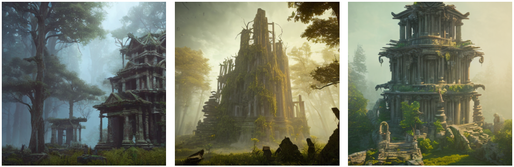
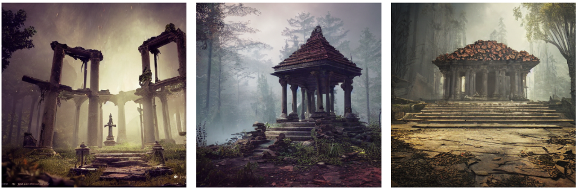

# Stable Diffusion Sandpit

## Introduction
Sandpit environment for experimenting with different stable diffusion models and prompts.

## Models
The two models used in this sandpit are the [Stable Diffusion v1.5](https://huggingface.co/runwayml/stable-diffusion-v1-5?text=a+photo+of+an+astronaut+riding+a+horse+on+mars) from **Runwayml** and [OpenJourney](https://huggingface.co/prompthero/openjourney) from **Prompthero**.

I have developed a function that allows you to process multiple images from a single prompt, these images are then stored in a list allowing you to select the one which you like the best.

The default is `2` images, it takes ~3-4 minutes to process a single image.

## Output Examples
Using the prompt:

```
temple in ruines, forest, stairs, columns, cinematic, detailed, atmospheric, epic, concept art, Matte painting, background, mist, photo-realistic, concept art, volumetric light, cinematic epic + rule of thirds octane render, 8k, corona render, movie concept art, octane render, cinematic, trending on artstation, movie concept art, cinematic composition , ultra-detailed, realistic, hyper-realistic, volumetric lighting, 8k –ar 2:3 –test –uplight
```

The [OpenJourney](https://huggingface.co/prompthero/openjourney) model produced the following images:



The [Stable Diffusion v1.5](https://huggingface.co/runwayml/stable-diffusion-v1-5?text=a+photo+of+an+astronaut+riding+a+horse+on+mars) model produced the following images:

